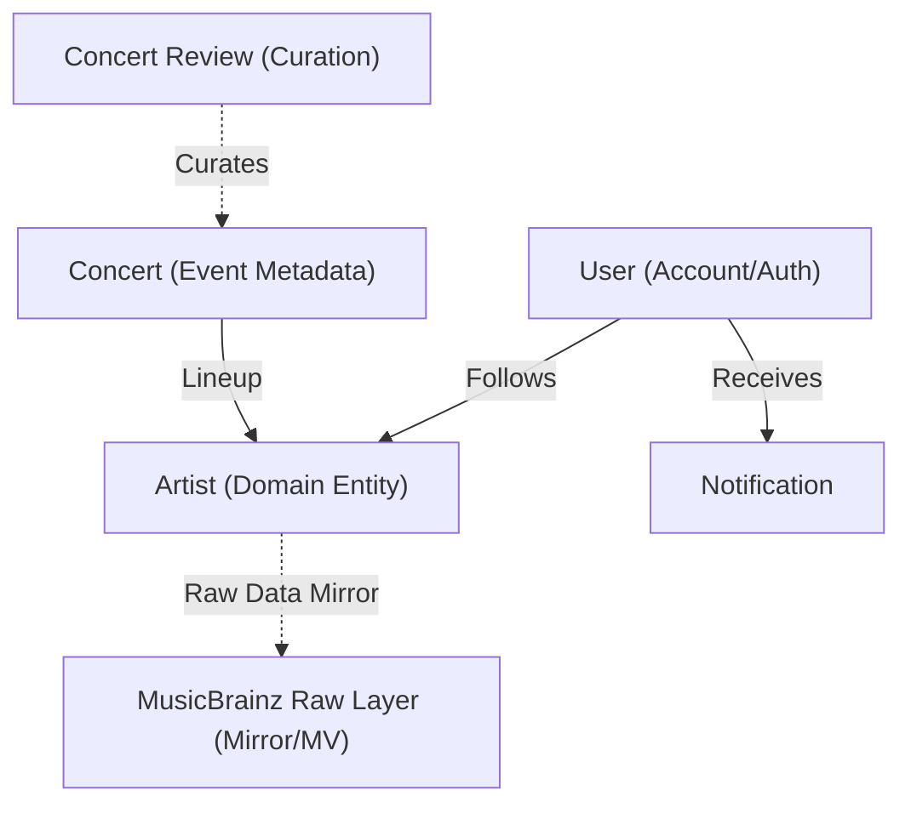

# 데이터베이스 아키텍처 (Database Architecture)

## 1. 아키텍처 개요 (Overview)

본 문서는 프로젝트의 데이터베이스 설계 원칙과 주요 도메인 모델의 구성을 설명합니다.
모든 테이블 명세(DDL)는 **Single Source of Truth**인 `prisma/schema.prisma`에서 관리됩니다.

- **DBMS**: PostgreSQL 17.6
- **ORM**: Prisma v7
- **Schema Source**: [`prisma/schema.prisma`](../prisma/schema.prisma)

---

## 2. 도메인 관계도 (ERD)

프로젝트 핵심 도메인 간의 관계는 다음과 같습니다.

---

## 3. 핵심 설계 전략 (Key Design Decisions)

### 3.1. 2-Layer Artist Data Architecture (아티스트 데이터 계층)

MusicBrainz의 오픈 데이터를 서비스에 직접 노출하지 않고, 필요한 데이터만 `Search -> Select` 과정을 통해 로컬 도메인 영역으로 가져오는 **Lazy Loading** 방식을 사용합니다.

- **Raw Layer (`mb_*`, `mv_*`)**: MusicBrainz 데이터를 1:1로 미러링하며, 주기적인 Replication을 통해 최신성을 유지합니다.
- **Domain Layer (`artists`)**: 실제 서비스 로직에서 사용하는 경량화된 아티스트 테이블입니다. `mbid`를 통해 Raw Layer와 연결됩니다.

이러한 구조는 외부 스키마 변경이 서비스 로직에 미치는 영향을 최소화하고(Isolation), 활성 데이터만 별도로 관리하여 조회 성능을 높이는 이점이 있습니다.

> 🔗 상세 아키텍처: **[Artist Data Architecture](./artist-data-architecture.md)**

### 3.2. Materialized View & Fuzzy Search (검색 엔진)

별도의 외부 검색 엔진 도입 없이 PostgreSQL의 내장 기능을 활용하여 비용 효율적인 검색 시스템을 구축했습니다.

- **Materialized View (`mv_artist_search`)**: 아티스트 이름 정규화(`unaccent`, `lower`)와 이명(Alias) Join 연산을 미리 수행하여 저장합니다.
- **pg_trgm (Trigram Index)**: `gin_trgm_ops` 인덱스를 통해 오타를 허용하는 **퍼지 검색(Fuzzy Search)**을 지원합니다.

이는 RDBMS 인프라 내에서 검색 요구사항을 충족시키며 시스템 복잡도를 낮추는 설계입니다.

### 3.3. JSONB for Flexible Metadata (비정형 데이터 처리)

KOPIS 등 외부 소스에서 가져오는 공연 정보(`concerts`) 중 정형화가 어려운 필드는 **JSONB (Binary JSON)** 타입을 사용합니다.

- **`relates`**: 예매처별 상이한 데이터 구조(링크, 가격 정책 등)를 수용합니다.
- **`analysis_result`**: AI 분석을 통해 생성되는 가변적인 아티스트 후보군 데이터를 저장합니다.

이를 통해 스키마 변경(`ALTER TABLE`) 없이 다양한 메타데이터 구조를 유연하게 처리할 수 있습니다.

---

## 4. 도메인 모델 구성 (Domain Models)

주요 테이블의 역할 정의는 다음과 같습니다.

| 모델 (Table)             | 역할 및 책임                          | 비고                          |
| :----------------------- | :------------------------------------ | :---------------------------- |
| **User**                 | 사용자 인증 및 기본 프로필 관리       | NextAuth.js 표준 스키마 준수  |
| **Account**              | OAuth 제공자(Google, Kakao) 연동 정보 | One User - Many Accounts 구조 |
| **Artist**               | 서비스 내 유효한 아티스트 엔티티      | **식별자: `mbid` (UUID)**     |
| **ArtistCustomAlias**    | 사용자/관리자 정의 아티스트 이명      | 검색 정확도 보정용            |
| **Concert**              | 공연 메타데이터, 일정, 장소 정보      | KOPIS 데이터 기반 + AI 보정   |
| **ConcertArtist**        | 공연-아티스트 간 출연 관계 (N:M)      | Role(Main/Guest) 구분 포함    |
| **UserArtist**           | 사용자의 아티스트 팔로우 관계         | 알림 발송의 기준 데이터       |
| **NotificationSettings** | 사용자별 알림 수신 설정               | 티켓 오픈, 등록 알림 등 제어  |
| **UserDevice**           | FCM Push Token 및 디바이스 정보       | 모바일/웹 푸시 발송 타겟      |
| **Notification**         | 발송된 알림 이력 및 읽음 상태         | FCM 발송 로그 성격            |

---

## 5. 인덱싱 전략 (Indexing Strategy)

주요 쿼리 성능 최적화를 위한 인덱스 구성입니다.

1. **Search Optimization**
   - `mv_artist_search` (`search_name_normalized`): `GIN (trigram)` 인덱스를 통해 아티스트 이름의 부분 일치 검색 성능을 보장합니다.

2. **Relation Lookups**
   - 모든 `Foreign Key` 컬럼에는 B-Tree 인덱스가 기본 생성됩니다(Prisma).
   - `UserArtist(userId, artistId)`: 복합 유니크 인덱스를 사용하여 중복 팔로우를 방지하고, 특정 사용자의 팔로우 목록 조회를 최적화합니다.

3. **Filtering & Sorting**
   - `Artist(mbid)`: 도메인 데이터와 Raw 데이터 간의 조인 성능을 위해 Unique Index를 사용합니다.

---

## 6. 데이터 관리 (Data Management)

- **Schema Migration**: `prisma migrate dev` 명령어를 통한 버전 관리 및 배포.
- **Raw Data Sync**: `scripts/musicbrainz/*` 파이프라인을 통한 MusicBrainz 데이터 증분 업데이트.
- **Seed Data**: 개발 환경 구성을 위한 `prisma db seed` 기초 데이터 주입.
