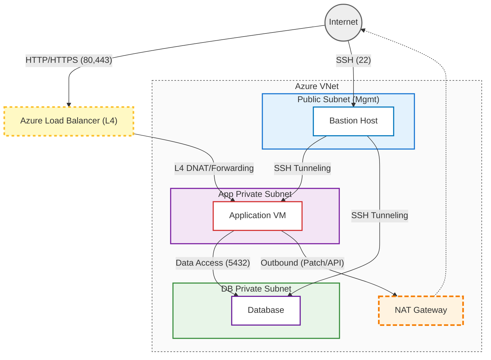

# 인프라 아키텍처 (Infrastructure Architecture)

## 1. 개요 (Overview)

본 프로젝트는 보안과 안정성을 위해 **Azure Virtual Network (VNet)** 내에서 철저히 격리된 네트워크 환경을 구성합니다. 외부 접근이 필요한 리소스와 내부에서만 동작해야 할 리소스를 분리(Subnetting)하여 공격 표면을 최소화하는 **보안 중심 아키텍처**를 지향합니다.

## 2. 네트워크 토폴로지 (Network Topology)

전체 네트워크는 하나의 VNet 내부에서 **Public Subnet**, **App Private Subnet**, **DB Private Subnet**으로 세분화되어 구성됩니다.

### 2.1. Azure Virtual Network (VNet)

- **역할**: 클라우드 상의 논리적 격리 공간 제공
- **구성**: 사설 IP 대역을 할당하여 내부 통신 수행

### 2.2. Subnets (서브넷 구성)

| 서브넷 이름              | 역할              | 접근 정책                                      | 배치 리소스         |
| :----------------------- | :---------------- | :--------------------------------------------- | :------------------ |
| **Public Subnet (Mgmt)** | 관리 및 외부 진입 | 인터넷 직접 접근 가능 (제한적)                 | Bastion Host        |
| **App Private Subnet**   | 애플리케이션 실행 | Load Balancer 통해 접근, 인터넷 직접 접근 불가 | Application VM      |
| **DB Private Subnet**    | 데이터 저장소     | App VM 및 Bastion에서만 접근 가능              | PostgreSQL Database |

## 3. 보안 구성 (Security Configuration)

### 3.1. Network Security Group (NSG)

각 서브넷은 별도의 NSG를 통해 트래픽을 엄격하게 통제합니다.

- **Public Subnet NSG**:
  - **Inbound**: SSH (22, 관리자 IP), HTTP/HTTPS (Web 트래픽 - LB 경유 시)
  - **Outbound**: App/DB Subnet으로의 SSH 연결

- **App Private Subnet NSG**:
  - **Inbound**:
    - Load Balancer로부터의 Service 트래픽 (HTTP:80 / HTTPS:443)
    - Bastion Host로부터의 SSH(22) 트래픽
  - **Outbound**: NAT Gateway를 통한 인터넷, DB 연결

- **DB Private Subnet NSG**:
  - **Inbound**:
    - App VM으로부터의 DB(5432) 트래픽
    - Bastion Host로부터의 SSH(22) 트래픽
  - **Outbound**: 차단 권장 (업데이트 필요 시 NAT 경유)

### 3.2. 접근 제어 전략 (Access Control)

- **SSH 접근**: 개발자는 직접 Private Subnet의 서버에 접속할 수 없습니다. 반드시 **Bastion Host (Jump Server)** 를 경유해서만 접속이 가능합니다.
- **Database 보안**: DB 포트(5432)는 오직 Private Subnet 내부의 App Server IP에서만 접근 가능하도록 방화벽 설정이 되어 있습니다.

## 4. 네트워크 연결성 (Connectivity)

### 4.1. NAT Gateway

- **목적**: Private Subnet에 위치한 서버들이 외부 인터넷(패키지 설치, 외부 API 호출 등)을 사용할 수 있도록 지원
- **특징**: 단방향 통신 지원 (내부 -> 외부 O, 외부 -> 내부 X), 고정 Public IP 제공

### 4.2. Route Table

- 서브넷 간의 트래픽 흐름을 정의하고, Private Subnet의 인터넷 트래픽을 NAT Gateway로 강제 라우팅합니다.

### 4.3. Load Balancer (Azure Load Balancer)

- **역할**: 외부에서 들어오는 웹 트래픽(HTTP/HTTPS)을 App Private Subnet에 위치한 애플리케이션 서버로 부하 분산(L4 Layer)하여 전달합니다.
- **구성**:
  - **Frontend IP**: 인터넷에서 접근 가능한 Public IP
  - **Backend Pool**: App Private Subnet의 Application VM
  - **Health Probe**: 주기적으로 VM 상태를 확인하여 정상적인 인스턴스로만 트래픽 전달
  - **Rules**: 80(HTTP), 443(HTTPS) 포트 요청을 백엔드 VM으로 포워딩

---

**Note**: 이 문서는 인프라 변경 사항에 따라 지속적으로 업데이트되어야 합니다.
