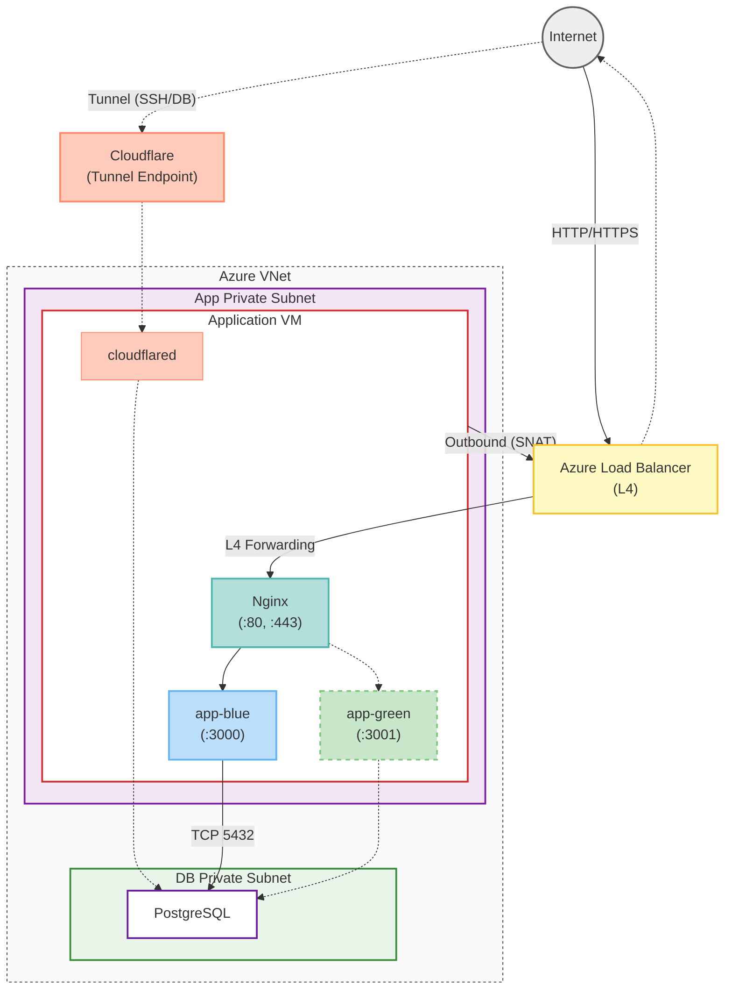

# 인프라 아키텍처 (Infrastructure Architecture)

## 1. 개요 (Overview)

본 프로젝트는 보안과 비용 효율성을 위해 **Azure Virtual Network (VNet)** 내에서 격리된 네트워크 환경을 구성합니다. 모든 리소스는 **Private Subnet**에 배치되어 인터넷에 직접 노출되지 않으며, 서비스 트래픽은 **Azure Load Balancer**를 통해, 관리 접근(SSH, DB 터널링)은 **Cloudflare Tunnel**을 통해 이루어집니다.

## 2. 인프라 아키텍처 (Infrastructure Architecture)

### 2.1. 아키텍처 다이어그램

전체 네트워크는 하나의 VNet 내부에서 **App Private Subnet**과 **DB Private Subnet**으로 구성됩니다.

**트래픽 흐름:**

- **실선**: 유저 서비스 트래픽 (Load Balancer → Nginx → App Container → DB)
- **점선**: 관리용 Cloudflare Tunnel (SSH 접속, DB 터널링)

### 2.2. Subnets (서브넷 구성)

| 서브넷 이름            | 역할              | 접근 정책                                       | 배치 리소스         |
| :--------------------- | :---------------- | :---------------------------------------------- | :------------------ |
| **App Private Subnet** | 애플리케이션 실행 | LB(서비스) / Cloudflare Tunnel(관리) 통해 접근  | Application VM      |
| **DB Private Subnet**  | 데이터 저장소     | App VM(서비스) / Cloudflare Tunnel(관리)로 접근 | PostgreSQL Database |

## 3. 보안 구성 (Security Configuration)

### 3.1. Network Security Group (NSG)

각 서브넷은 별도의 NSG를 통해 트래픽을 엄격하게 통제합니다.

- **App Private Subnet NSG**:
  - **Inbound**:
    - Load Balancer로부터의 Service 트래픽 (HTTP:80 / HTTPS:443)
    - Cloudflare Tunnel은 Outbound 연결이므로 별도 Inbound 규칙 불필요
  - **Outbound**: Load Balancer를 통한 인터넷, DB 연결

- **DB Private Subnet NSG**:
  - **Inbound**: App VM으로부터의 DB(5432) 트래픽만 허용
  - **Outbound**: 차단 (필요 시 개별 허용)

### 3.2. 접근 제어 전략 (Access Control)

- **SSH 접근**: 개발자는 **Cloudflare Access**를 통해 인증 후 Cloudflare Tunnel을 경유해서만 VM에 접속할 수 있습니다. VM에 Public IP가 없으므로 직접 SSH 접속은 불가능합니다.
- **Database 접근**: 애플리케이션은 Private Subnet 내에서 직접 DB에 연결하며, 개발자는 **Cloudflare Tunnel을 통한 DB 터널링**으로 접근합니다. DB는 인터넷에 노출되지 않습니다.

## 4. 네트워크 연결성 (Connectivity)

### 4.1. Cloudflare Tunnel

- **목적**: Public IP 없이 관리 접근(SSH, DB 터널링) 제공
- **구성**: VM 내부에서 `cloudflared` 데몬이 Cloudflare Edge로 Outbound 연결을 유지
- **용도**:
  - **SSH 접속**: Cloudflare Access 인증 후 VM에 SSH 접근
  - **DB 터널링**: 로컬 개발 환경에서 Private Subnet의 PostgreSQL에 안전하게 접근
- **장점**:
  - Inbound 포트 개방 불필요 (공격 표면 최소화)
  - Cloudflare Access를 통한 Zero Trust 인증

### 4.2. Load Balancer (Azure Load Balancer)

- **역할**:
  - **Inbound**: 외부 웹 트래픽을 App VM으로 전달 (L4 Layer)
  - **Outbound**: Private Subnet의 VM이 인터넷에 접근할 수 있도록 SNAT 제공
- **구성**:
  - **Frontend IP**: 인터넷에서 접근 가능한 Public IP
  - **Backend Pool**: App Private Subnet의 Application VM
  - **Health Probe**: 주기적으로 VM 상태를 확인
  - **Outbound Rules**: VM의 외부 API 호출, 패키지 다운로드 등에 사용

### 4.3. Route Table

- 서브넷 간의 트래픽 흐름을 정의합니다.
- App Subnet의 기본 인터넷 트래픽은 Load Balancer의 Outbound IP를 통해 나갑니다.

---

**Note**: 이 문서는 인프라 변경 사항에 따라 지속적으로 업데이트되어야 합니다.
