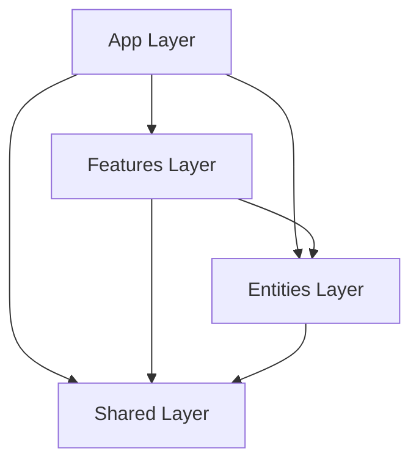

# 공연 알림 서비스 - Next.js 프로젝트 구조

## 문서 정보

- **문서명**: Next.js App Router 프로젝트 구조
- **프로젝트**: 공연 알림 서비스
- **Framework**: Next.js 16 (App Router)
- **Architecture**: Feature-Sliced Design (Strict Vertical Slices)

---

## 아키텍처 개요 (Feature-Sliced Design)

이 프로젝트는 **Feature-Sliced Design (FSD)** 아키텍처를 따릅니다.
코드베이스는 **레이어(Layer)**, **슬라이스(Slice)**, **세그먼트(Segment)**의 3단계로 구성됩니다.

### 의존성 규칙 (Dependency Rule)

**의존성은 항상 "위에서 아래로(Unidirectional)"만 흘러야 합니다.**



1.  **상위 레이어는 하위 레이어를 참조할 수 있습니다.**
2.  **하위 레이어는 상위 레이어를 참조할 수 없습니다.** (예: Entity는 Feature를 알 수 없음)
3.  **동일 레이어 간의 참조는 금지됩니다.** (예: Feature A -> Feature B 금지, Entity A -> Entity B 금지)

---

## 디렉토리 구조 (Directory Structure)

```bash
src/
├── app/                    # [Layer] App: Composition Root
│   ├── (auth)/             #   - 인증 관련 라우트 그룹
│   ├── (main)/             #   - 메인 라우트 그룹
│   ├── api/                #   - Next.js API Routes (Webhooks 등)
│   └── layout.tsx          #   - Root Layout, Global CSS Import
│
├── features/               # [Layer] Features: User Scenarios (사용자 기능)
│   ├── [slice]/            #   [Slice] 예: authentication, ticketing, search
│   │   ├── ui/             #     [Segment] Smart UI (Container, Form, Interaction)
│   │   ├── model/          #     [Segment] Business Logic (Hook, Store, Schema)
│   │   ├── api/            #     [Segment] Orchestration (Server Actions)
│   │   ├── lib/            #     [Segment] Helpers (해당 기능 전용 유틸리티)
│   │   └── index.ts        #     [Public API] 외부 노출 모듈 정의
│
├── entities/               # [Layer] Entities: Business Domain (비즈니스 실체)
│   ├── [slice]/            #   [Slice] 예: user, concert, artist, notification
│   │   ├── ui/             #     [Segment] Dumb UI (Presentational, Props only)
│   │   ├── model/          #     [Segment] Domain Model (Type, Service, Cache)
│   │   ├── api/            #     [Segment] Data Access (Repository, DB)
│   │   └── index.ts        #     [Public API] 외부 노출 모듈 정의
│
├── shared/                 # [Layer] Shared: Reusable Infrastructure (공용 인프라)
│   ├── ui/                 #   - 공용 UI 컴포넌트 (Button, Modal, Input - Shadcn/ui)
│   ├── layout/             #   - 레이아웃 컴포넌트 (Header, Footer)
│   ├── lib/                #   - 유틸리티 (Prisma, Date, Axios)
│   ├── hooks/              #   - 공용 Hooks
│   ├── providers/          #   - 전역 Providers (QueryClient, Session)
│   ├── constants/          #   - 상수 정의
│   └── types/              #   - 전역 타입 정의
│
├── proxy.ts                # [Interceptor] Lightweight Request Proxy (Middleware 대체)
└── ...
```

---

## 레이어별 상세 역할 (Roles & Responsibilities)

### 1. App Layer (`src/app`)

- **역할**: 애플리케이션의 진입점. 하위 레이어의 요소들을 **조합(Composition)**하여 페이지를 구성합니다.
- **규칙**:
  - 비즈니스 로직을 직접 포함하지 않습니다.
  - Feature의 UI와 Server Action을 연결하는 역할을 수행합니다.

### 2. Features Layer (`src/features`)

- **역할**: 사용자에게 가치를 제공하는 구체적인 **기능 단위(User Scenario)**.
- **구성**:
  - **`ui`**: 사용자와 상호작용하는 컴포넌트 (`LoginForm`, `SearchFilter`). Entity UI를 포함하여 구성할 수 있습니다.
  - **`model`**: 해당 기능을 수행하기 위한 상태 판별, 유효성 검사, React Query Hooks.
  - **`api`**: **Orchestration(조율)**을 담당하는 Server Actions.
    - 클라이언트 요청 수신 → 유효성 검사 → Entity Service/Repository 호출 → 응답 반환.
- **예시**: `concerts` (공연 목록 조회 및 필터링), `auth` (로그인/회원가입 프로세스), `search` (통합 검색).

### 3. Entities Layer (`src/entities`)

- **역할**: 비즈니스 로직의 핵심이 되는 **도메인 모델(Business Domain)**.
- **구성**:
  - **`ui`**: 데이터 표현에 집중하는 순수 컴포넌트 (`ArtistCard`, `ConcertBadge`). 상태나 로직이 없거나 최소화되어야 합니다.
  - **`model`**: 핵심 데이터 타입(`type`), 도메인 서비스 로직(`*.service.ts`), 캐싱 정책(`use cache`).
  - **`api`**: **Data Access(데이터 접근)**를 담당하는 Repository. Prisma 호출이나 외부 API(Spotify, KOPIS) 호출.
- **주의**: Entity는 어떤 Feature에서 사용될지 알 수 없으므로, 특정 유즈케이스에 종속적인 로직을 포함하면 안 됩니다.

### 4. Shared Layer (`src/shared`)

- **역할**: 특정 도메인에 종속되지 않는 범용적인 코드.
- **구성**: 디자인 시스템 컴포넌트(`ui`), 레이아웃(`layout`), 유틸리티 라이브러리(`lib`), 전역 훅(`hooks`) 등.

---

## Segment 상세 가이드 (Segment Guide)

각 Slice 내부의 폴더(Segment) 역할 정의입니다.

### A. UI Segment (`ui/`)

| 구분       | Entities UI                          | Features UI                                 |
| :--------- | :----------------------------------- | :------------------------------------------ |
| **성격**   | Dumb / Presentational                | Smart / Container                           |
| **데이터** | Props로만 데이터 수신                | 데이터를 직접 Fetch하거나 Store 연결        |
| **로직**   | 데이터 포맷팅 등 표현 로직만 허용    | 이벤트 핸들링, 폼 제출, 상태 관리 로직 포함 |
| **예시**   | `ArtistProfileImage`, `ConcertTitle` | `LoginModal`, `ArtistSubscribeButton`       |

### B. Model Segment (`model/`)

- **Types**: 해당 슬라이스에서 사용하는 TypeScript 타입 정의.
- **Service (`*.service.ts`)**:
  - **순수 비즈니스 로직**과 **캐싱 전략**을 담당.
  - `use cache`, `cacheTag`는 주로 이곳에서 선언합니다.
  - Repository를 호출하여 데이터를 가져오고, 비즈니스 요구사항에 맞게 가공합니다.
- **Hooks**: Client-side 로직을 위한 Custom Hooks.

### C. API Segment (`api/`)

| 구분       | Entities API (Repository)           | Features API (Actions)                            |
| :--------- | :---------------------------------- | :------------------------------------------------ |
| **역할**   | **Data Access Layer (DAO)**         | **Controller / Orchestrator**                     |
| **내용**   | Prisma Query, External API Fetch    | Server Actions (`use server`)                     |
| **특징**   | 로직 없이 순수 CRUD/Fetch 수행      | 유효성 검사, 권한 체크 후 Repository/Service 호출 |
| **Naming** | `find...`, `create...`, `update...` | `Verb`+`Noun` (ex: `login`, `submitReview`)       |

### D. Lib Segment (`lib/`)

- **역할**: 해당 Slice 내에서만 사용하는 헬퍼 함수 및 유틸리티.
- **예시**: 날짜 포맷팅, 가격 계산, 문자열 변환 등.
- **주의**: 여러 Slice에서 공통으로 사용되는 유틸리티는 `shared/lib`로 이동합니다.

---

## 주요 개발 규칙 (Development Rules)

### 1. Public API (Index File) 활용

- 모든 Slice는 최상위 `index.ts`를 가져야 합니다.
- **외부에서는 반드시 `index.ts`를 통해서만 import 해야 합니다.**
- **Repository와 Service는 Namespace Export 형식을 사용합니다.**
  - `export * as ArtistRepository from './api/repository';`
  - `export * as ArtistService from './model/artist.service';`
  - 사용 시: `ArtistRepository.findArtist(...)`
- 내부 구조(`ui`, `model` 등)로 직접 접근하는 Deep Import는 금지됩니다.
  - ❌ `import { ArtistCard } from '@/entities/artist/ui/ArtistCard'`
  - ✅ `import { ArtistCard } from '@/entities/artist'`

### 2. Cross-Boundary 참조 금지

- **Features -> Features**: 금지. 필요 시 상위(App)에서 조합하거나 Shared로 로직 이동.
- **Entities -> Entities**: 금지. 필요 시 상위(Features)에서 데이터를 조합하여 해결.
  - 예: `Concert` Entity에서 `Artist` 정보가 필요하다면, Repository 레벨에서 조인(Join)하여 가져오거나 Feature 서비스에서 두 Entity를 호출하여 합칩니다.

### 3. Server Isolation (서버 격리)

- 서버 전용 코드(DB 접근, 비밀 키 사용 등)는 반드시 `api`, `model` 내부의 서버 전용 파일에 위치해야 합니다.
- 클라이언트 컴포넌트에서 서버 모듈을 직접 import 하지 않도록 주의합니다.

### 4. 캐싱 전략 (Caching Strategy)

- **캐싱 위치**: **Feature Layer의 Service**에서 수행하는 것을 원칙으로 합니다.
  - Entity Service는 순수 도메인 로직에 집중하며, 캐싱은 상위 레이어(Feature)에서 처리합니다.
  - 단, Entity 내에서만 사용되는 무거운 연산이 있다면 Entity Service 내부 캐싱도 허용됩니다.
- **구현 방식**: `Next.js`의 `use cache` API를 사용합니다.
- Repository(`api/`)에는 캐싱 로직을 포함하지 않습니다.

### 5. 구현 스타일 (Implementation Style)

- **Repository & Service**:
  - `class` 대신 **개별 함수(`export function`)** 형태로 작성합니다.
  - Tree Shaking에 유리하며, 필요한 함수만 import하여 사용할 수 있습니다.

### 6. ESLint Boundaries

`eslint.config.mjs`를 통해 다음 규칙을 강제할 수 있습니다:

- **Shared**: `features`, `entities`를 참조할 수 없음. 오직 다른 `shared` 모듈만 참조 가능.
- **Entities**: `features`를 참조할 수 없음. 다른 `entities`도 참조 금지.
- **Features**: 다른 `features`를 직접 import 할 수 없음. `entities`와 `shared`만 참조 가능.
- **App**: `features`, `entities`, `shared`를 모두 import 하여 조합(Composition) 가능.

---

## Server/Client Component 사용 기준

### Server Components (기본값)

- 데이터 페칭이 필요한 페이지
- SEO가 중요한 페이지 (공연 상세, 아티스트 상세)
- DB 접근이 필요한 로직
- 예: `app/(main)/concerts/[id]/page.tsx`

### Client Components (`'use client'`)

다음 조건 중 **하나라도 해당**되면 Client Component로 선언합니다:

- **이벤트 핸들러 사용**: `onClick`, `onChange`, `onSubmit` 등
- **브라우저 API 사용**: `localStorage`, `window`, `navigator` 등
- **React Hooks 사용**: `useState`, `useEffect`, `useRef` 등
- **상태 관리 라이브러리 사용**: Zustand Store, React Query Hooks 등
- 예: `SearchBar`, `FollowButton`, `Modal`

---

## 파일 네이밍 컨벤션 (File Naming Convention)

| 파일 유형          | 네이밍 패턴     | 예시                                      |
| :----------------- | :-------------- | :---------------------------------------- |
| **컴포넌트**       | PascalCase      | `ArtistCard.tsx`, `LoginForm.tsx`         |
| **서비스**         | `*.service.ts`  | `artist.service.ts`, `concert.service.ts` |
| **Repository/DB**  | `repository.ts` | `repository.ts`                           |
| **Server Actions** | `actions.ts`    | `actions.ts`                              |
| **타입 정의**      | `types.ts`      | `types.ts`                                |
| **Hooks**          | `use*.ts`       | `useArtistQuery.ts`, `useLoginForm.ts`    |
| **Zustand Store**  | `*Store.ts`     | `authStore.ts`, `filterStore.ts`          |
| **상수**           | `constants.ts`  | `constants.ts`                            |
| **Public API**     | `index.ts`      | `index.ts`                                |

### 함수 네이밍 규칙

| 레이어/역할       | Prefix                               | 예시                                                     |
| :---------------- | :----------------------------------- | :------------------------------------------------------- |
| **Repository**    | `find`, `create`, `update`, `delete` | `findArtistById`, `createConcert`                        |
| **Service**       | `get`, `fetch`, `process`, `sync`    | `getConcertDetail`, `fetchSpotifyArtists`                |
| **Server Action** | `...Action` 접미사                   | `loginAction`, `submitReviewAction`, `getConcertsAction` |
